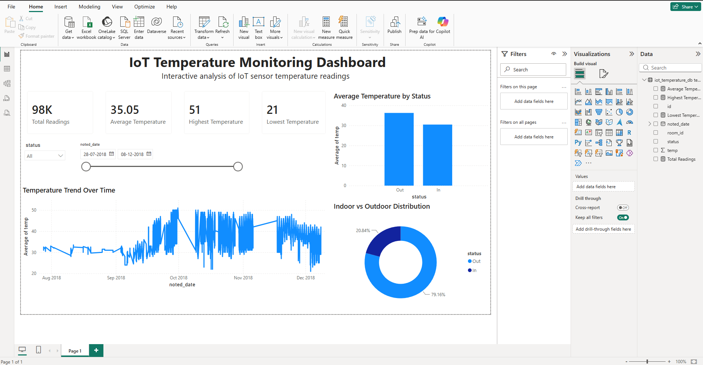

# 🌡️ IoT Temperature Monitoring Dashboard


---

## 📊 Dashboard Preview



---

## 📌 Project Overview

This project presents an interactive Power BI dashboard built to analyze IoT temperature sensor data. It transforms raw sensor readings into meaningful insights through interactive visualizations and KPIs.

---

## 📈 Dashboard Features

- 📊 KPI Cards
  - Total Readings
  - Average Temperature
  - Highest Temperature
  - Lowest Temperature

- 📅 Date Range Slicer

- 🔄 Status Filter (Indoor / Outdoor)

- 📉 Temperature Trend Over Time

- 📊 Average Temperature by Status

- 🍩 Indoor vs Outdoor Distribution

---

## 🛠 Tools Used

- Microsoft Power BI
- Power Query
- DAX
- CSV Dataset

---

## 📂 Dataset Columns

- ID
- Temperature
- Status
- Date

---

## 💡 Key Insights

- Approximately **79%** of the readings were collected from one sensor status category.
- Average recorded temperature is **35°C**.
- Maximum temperature recorded is **51°C**.
- Minimum temperature recorded is **21°C**.
- Interactive filters allow dynamic exploration of temperature trends.

---

## 📁 Repository Contents

```
IoT-Temperature-Monitoring-Dashboard
│
├── IoT_Temperature_Dashboard.pbix
├── dashboard.png
├── dashboard.pdf
├── dataset.csv
└── README.md
```

---

## 🚀 Skills Demonstrated

- Data Cleaning
- Data Modeling
- DAX Measures
- Dashboard Design
- Business Intelligence
- Data Visualization
- Data Storytelling

---

## 👩‍💻 Author

**Sweksha Kumari**

Aspiring Data Analyst | Power BI | SQL | Excel | Python

---
⭐ If you like this project, consider giving it a star!
